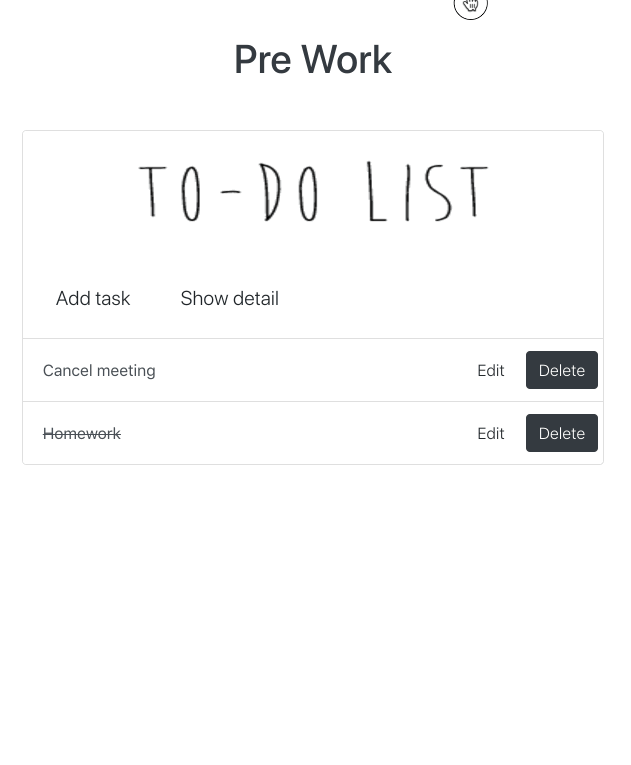
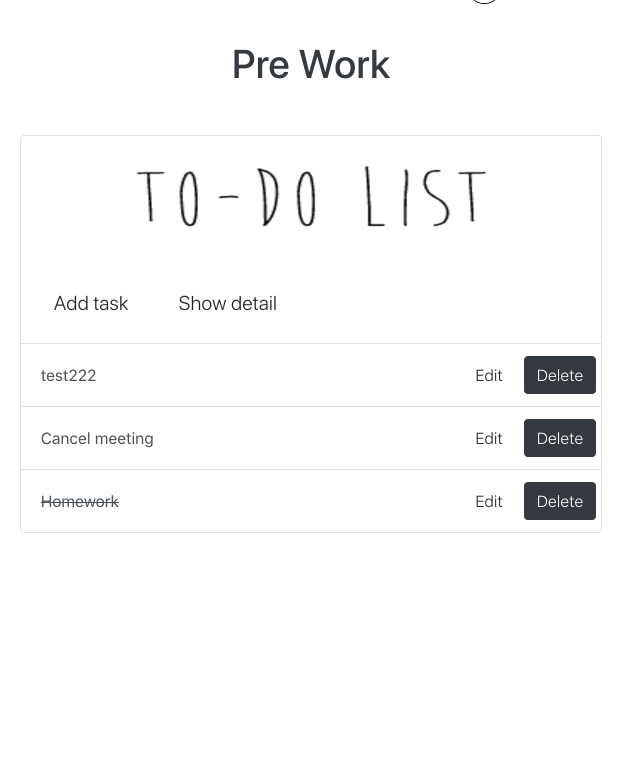

# TO DO LIST PROJECT

[中文. ver](README_zh.md)

## Function
- [x] Add a task
- [x] Delete a task
- [x] Mark a task as "Completed"
- [x] Edit description of task
- [x] List all tasks

## TODO
- [x] Flip page (paginator)

## Example
***
> Add a task



> Edit a task and show detail


> Mark a task as "Complete" and delete it



## Install
***
Download this repository
```python
    git clone https://github.com/zzdqqqq/todolist_python
```
Set up a virtual environment, and install requirement. This project is based on Python2 and Django1.8. You can check detail in requirement.txt

```python
    virtualenv env
    pip install -r requirement.txt
```
Redirect to "todolist_project" folder
```python
    cd todolist_project
```
Migrate datebase, this project is based on PostgreSQL.
```python
    python manage.py makemigration todolist
    python manage.py migrate
```
Run Django server
```python
    python manage.py runserver
```
Run React server
```javascript
    npm start
```
