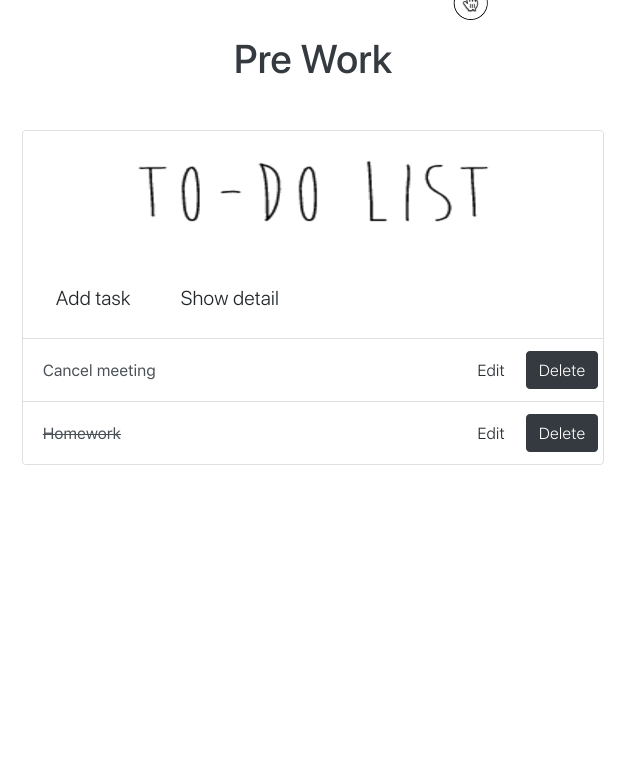
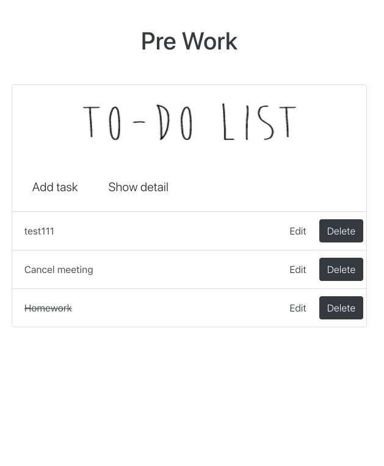

# TO DO LIST PROJECT

[Eng. ver](README.md)

## 主要功能
- [x] 增加一个待办事项
- [x] 删除一个待办事项
- [x] 标记一个待办事项为已完成
- [x] 编辑一个待办事项的具体内容
- [x] 列出所有的待办事项

## 待实现功能
- [ ] 列表界面支持翻页

## 功能展示
***
> 增加一个待办事项



> 编辑一个待办事项，以及查看具体内容



> 标记事件已完成并删除


## 如何运行
***

```python
    git clone https://github.com/zzdqqqq/todolist_python
```
首先在根目录建立虚拟环境，并安装requirement
该项目基于python2 和 Django 1.8 ，具体版本号在requirement.txt中查看
```python
    virtualenv env
    pip install -r requirement.txt
```
跳转到manage.py所在目录
```python
    cd todolist_project
```
进行数据库迁移，此项目使用PostgreSQL，若想使用sqlite，可在settings.py的DATABASE中更改注释内容
```python
    python manage.py makemigration todolist
    python manage.py migrate
```
运行Django服务器
```python
    python manage.py runserver
```
运行前端服务器
```javascript
    npm start
```
